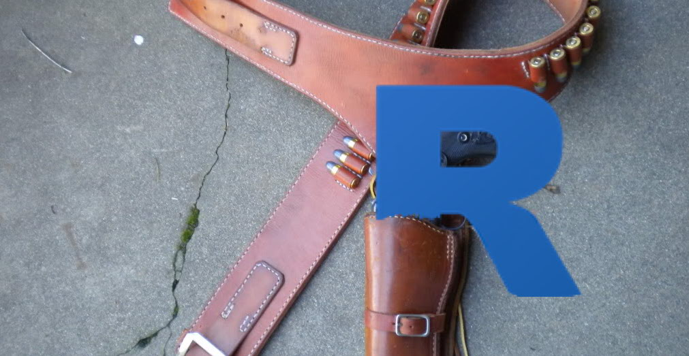

holstr 
============

-   Installation
-   Contact

**holstr** is a set of packages/functions you always want to have at your side.

Installation
============

To download the development version of **holstr**:

Download the [zip
ball](https://github.com/data-steve/holstr/zipball/master) or [tar
ball](https://github.com/data-steve/holstr/tarball/master), decompress
and run `R CMD INSTALL` on it, or use the **pacman** package to install
the development version:

    if (!require("pacman")) install.packages("pacman")
    pacman::p_load_gh("data-steve/holstr")

Contact
=======

You are welcome to: \* submit suggestions and bug-reports at:
<https://github.com/data-steve/holstr/issues> \* send a pull request
on: <https://github.com/data-steve/holstr/> \* compose a friendly
e-mail to: <steven.troy.simpson@gmail.com>
